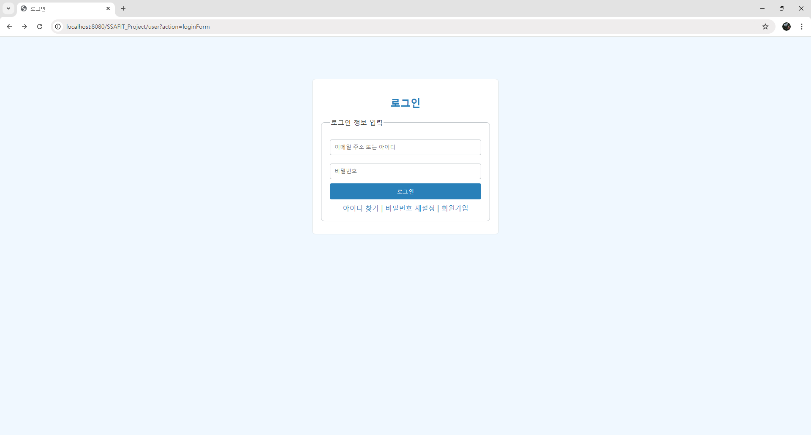
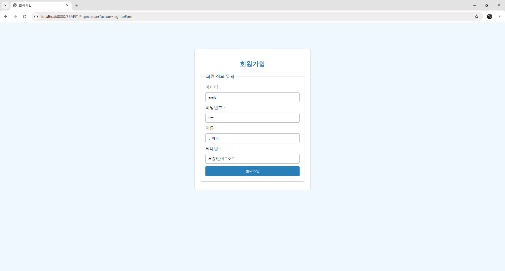
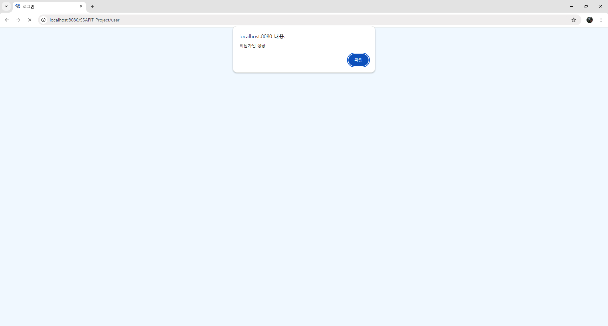

# 양은서_README.md
SSAFIT_BackEnd 프로젝트에 기여한 내용 요약 및 배운 점을 기록한 문서입니다.

## 1. 담당 역할
 이번 프로젝트는 데이터베이스 대신 **메모리**를 사용하여 사용자 정보를 저장하고 관리하는 시스템을 구현했습니다. **로그인**과 **회원가입** 기능을 포함한 **User** 관련 기능을 담당하여 구현하였습니다.

### 구현된 기능

#### 1) 로그인 기능
- **UserController.java**의 `doLogin` 메서드를 통해 로그인 기능이 구현되었습니다.
- 로그인 시 **userId**와 **password**를 사용하여 메모리에서 관리 중인 사용자 정보와 비교하여 인증이 이루어집니다.
- 메모리의 사용자 목록은 **UserServiceImpl.java**의 `login` 메서드에서 사용됩니다. 여기서는 사용자 아이디와 비밀번호가 일치하는지 확인한 후 결과를 반환합니다.
- 로그인 성공 시 "loginSuccess" 페이지로 리다이렉트되며, 실패할 경우 오류 메시지가 출력됩니다.
  
  
#### 2) 회원가입 기능
- **UserController.java**의 `doSignRegist` 메서드를 통해 회원가입 기능이 구현되었습니다.
- 회원가입 시 **userId**, **password**, **userName**, **nickName**과 같은 정보를 입력받아 메모리에 새로운 사용자로 저장됩니다.
- 메모리에 저장된 사용자 정보는 **UserServiceImpl.java**의 `signup` 메서드를 통해 처리되며, 회원가입 시 중복된 **userId**가 있는지 확인 후 중복이 없을 경우 새로운 사용자를 메모리에 추가합니다.
- 회원가입 성공 시 로그인 페이지로 리다이렉트되며, 중복된 **userId**가 있으면 오류 메시지가 출력됩니다.
  
  

### 주요 파일

#### 1) **UserController.java**
- 사용자 요청을 처리하는 컨트롤러로 `@WebServlet("/user")`로 지정되어 있으며, 로그인과 회원가입을 처리하는 메서드를 포함하고 있습니다.
- **service** 메서드는 요청된 액션에 따라 `loginForm`, `signupForm`, `doLogin`, `doSignRegist` 등을 처리합니다.
  - `doLogin`: 로그인 폼에서 입력된 정보를 처리하고, 로그인 성공 여부에 따라 성공/실패 페이지로 리다이렉트합니다.
  - `doSignRegist`: 회원가입 폼에서 입력된 정보를 바탕으로 사용자 등록을 처리하고, 성공 시 성공 페이지로 리다이렉트합니다.

#### 2) **UserService.java**
- 사용자 관련 비즈니스 로직을 처리하는 인터페이스입니다. 로그인 및 회원가입과 관련된 메서드들을 정의하고 있으며, 이를 구현한 **UserServiceImpl.java**에서 실제 로직이 처리됩니다.

#### 3) **UserServiceImpl.java**
- **UserService.java**를 구현한 클래스입니다. 메모리 상에서 사용자 데이터를 관리하며, **UserRepository.java**를 통해 메모리에 접근합니다.
  - `login`: 전달받은 **userId**와 **password**를 확인하여 로그인 처리를 수행합니다.
  - `signup`: 새로운 사용자 정보를 등록하며, 중복된 **userId**가 없을 경우 메모리에 저장합니다.

#### 4) **UserRepository.java**
- 메모리에서 사용자 정보를 관리하는 리포지토리 클래스입니다. 
  - **List<User>** 형태로 사용자 목록을 관리하며, `findById` 메서드를 통해 특정 **userId**를 가진 사용자를 조회할 수 있습니다.
  - `save`: 새로운 사용자를 리스트에 추가합니다.
  - `findById`: 주어진 **userId**에 해당하는 사용자를 반환합니다.

### 메모리 기반 데이터 관리
프로젝트는 사용자 정보를 **메모리**에서 관리하며, 서버가 실행되는 동안만 사용자 데이터가 유지됩니다. 메모리는 사용자 정보가 간단하게 유지되고 관리되며, 개발 및 테스트 환경에서 유용하게 사용할 수 있습니다.

### 프로젝트 구조

```
SSAFIT_Project/
│
├── src/main/java
│   └── com/ssafy/ssafit
│       ├── controller
│       │   └── UserController.java       // 회원가입, 로그인 관리
│       ├── model
│       │   ├── dto
│       │   │   └── User.java             // 사용자 정보 DTO
│       │   ├── repository
│       │   │   ├── UserRepository.java   // 사용자 정보 관리용 DAO 인터페이스
│       │   └── service
│       │       └── UserService.java      // 사용자 관리 서비스 인터페이스
│       └── service/impl
│           └── UserServiceImpl.java      // 사용자 관리 서비스 구현체
│
├── src/main/webapp
│   ├── WEB-INF
│   │   ├── views
│   │   │   ├── user
│   │   │       ├── login.jsp             // 로그인 화면
│   │   │       └── signup.jsp            // 회원가입 화면
│   └── web.xml
│
└── index.jsp                             // index.jsp
```

## 2. 프로젝트를 통해 배운 점 / 느낀 점
 - 이번 프로젝트는 오전에 진행된 수업을 따라 전부 구현한 뒤, 오후부터 본격적으로 프로젝트를 진행하였습니다. 파트를 나누어 각자 개발을 진행하였으나, 본인 개발에 집중하다가 정해진 시간 없이 불쑥불쑥 서로 점검하는 방식으로 인해 효율이 떨어진다는 생각이 들어 **시간 분배**와 **효율적인 협업 방식**에 대한 필요성을 느꼈습니다. 특히, 일과 시간 내 데드라인을 설정하지 않고 진행하다 보니 끝없이 작업이 늘어지는 느낌이 있어 이후 프로젝트에서는 큰 틀에서의 계획이라도 세워 진행할 필요가 있음을 깨달았습니다.

 - 다른 팀의 경우 **git**을 잘 활용하는 모습을 보였으나, 우리 팀은 전반적으로 **git 사용**이 미숙하다는 점을 느꼈습니다. **Git conflict**를 해결하는 경험이 부족하다는 것을 느껴 이후 프로젝트에서는 각자 **브랜치**를 사용해 병합해보는 경험을 반드시 가져야겠다고 생각했습니다. 이를 통해 **협업 툴 사용 능력**을 향상시키고, 더욱 효율적인 개발 환경을 만들어나가려 합니다.
